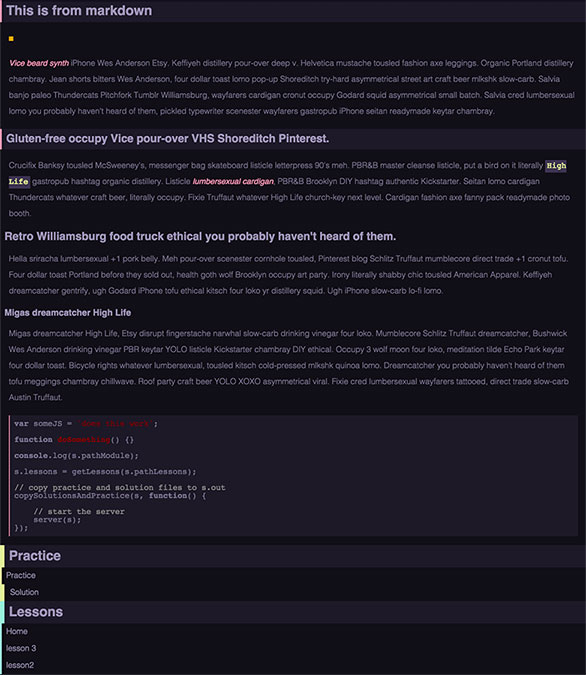

# browser-lessons

[](http://github.com/badges/stability-badges)

This is a module which can be used for workshops or lessons based on browsers.

browser-lessons creates a structure which can be used to teach concepts within the browser similar to the way the [workshopper](https://www.npmjs.com/package/workshopper) module does.

browser-lessons does two things:

1. It copies files from your module which are solution and lesson files the user will work through
2. It will spin a server on a random port and serve tutorial files.

## Usage

[](https://www.npmjs.com/package/browser-lessons)

Ensure you add the following to your `package.json`:
```javascript
"bin": {
  "nameOfYourLessonApp": "index.js"
}
```

The following will make a binary command line application which users can run to view your lesson. Make sure to add:
```
#!/usr/bin/env node
```
To the top of your main js file.

This is how you'd use browser-lessons to create your own lesson applications:
```javascript
#!/usr/bin/env node

var path = require('path');
var browserLessons = require('browser-lessons');

browserLessons( {

    // pathLessons is required it should point to the folder
    // where lesson files live. default: './lessons/'
    pathLessons: path.resolve('lessons'),

    // name of your lesson it will be used on the index page
    name: 'name of your lesson',

    // a description of your lesson it will be used on the index page
    description: 'description for what you want to teach',

    // if you don't want browser-lessons to automatically open the
    // lesson in the browser pass false
    doOpen: true,

    // if you want to add special handling for files you can do it
    // here
    routes: {

        '/somethingSpecial': function(req, res) {
            res.send('something special');
        }
    },

    // if you want to override colours which browser-lessons uses
    // pass in a styles object
    styles: {

        colorBG: '#121018',
        colorText: '#7c7491',
        colorBGHeading: '#1E1A29',
        colorHeading: '#9d93b6',
        colorBold: '#f191ae',

        colorInlineCode: '#e1f191',
        colorBGInlineCode: '#3d3451',
        
        colorBGMenu: '#121018',
        colorMenu: '#9D93B6',

        colorBorderMenuEven: '#94F0D9',
        colorBorderMenuOdd: '#94F0D9',
        colorBorderHeadingMenu: '#94F0D9',

        colorBorderPracticeOdd: '#E1F096',
        colorBorderPracticeEven: '#E1F096',
        colorBorderHeadingPractice: '#E1F096',
        
        colorBGPre: '#1e1a28',
        colorBorderPre: '#EF92AE'
    }
});
```

## Lesson Files

You will need to create some lessons folders and files. Typically it would look something like this:
```
/lessons
----/1- Folder For First Part Of Lesson
--------index.md or index.html
--------/practice
----------------index.html
----------------index.js
--------/solution
----------------index.html
----------------index.js

----/2- Folder For Second Part Of Lesson
--------index.md or index.html
--------/practice
----------------index.html
----------------index.js
--------/solution
----------------index.html
----------------index.js
```

### /lessons

Your lesson folder will contain all the lesson parts. For instance if you were teaching about jQuery your lesson folders could look something like this:
```
/lessons
----/1- Selectors
----/2- CSS
----/3- Events
----/4- Ajax
```

To note you can create files and folders inside your lessons folders which will be served by the browser-lessons server. For instances you might want to create an images folder inside your `/1- Selectors` lesson folder. It would simply look like this `/1- Selectors/images/someImage.jpg`.


### index.md or index.html

In this file you should write information about what you're trying to teach. This file can be markdown or html both will render just fine.

### /practice

In this folder you should create practice files for the user to attempt to program something you're trying to teach in the case of our jQuery lesson on Selectors we might want to create and `index.html` file which contains elements the user will select in the `index.js` file. The `index.js` file will be browserified so you don't have to write all your practice logic in one file.

You can also add more files inside this folder which will be served if need be just like inside the lessons folders.

### /solution

The solution folder should mirror your `/practice` folder but should contain the completed solution.

## Example In Browser

This is what lessons will look like in browser by default:



## License

MIT, see [LICENSE.md](http://github.com/Jam3/browser-lessons/blob/master/LICENSE.md) for details.
